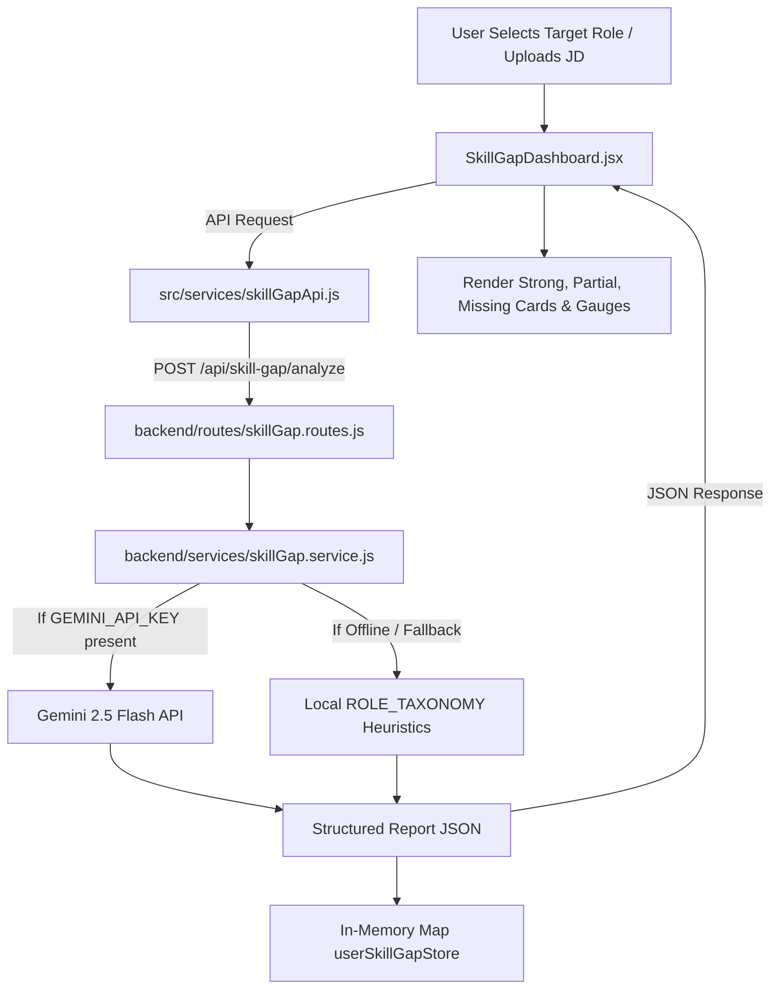
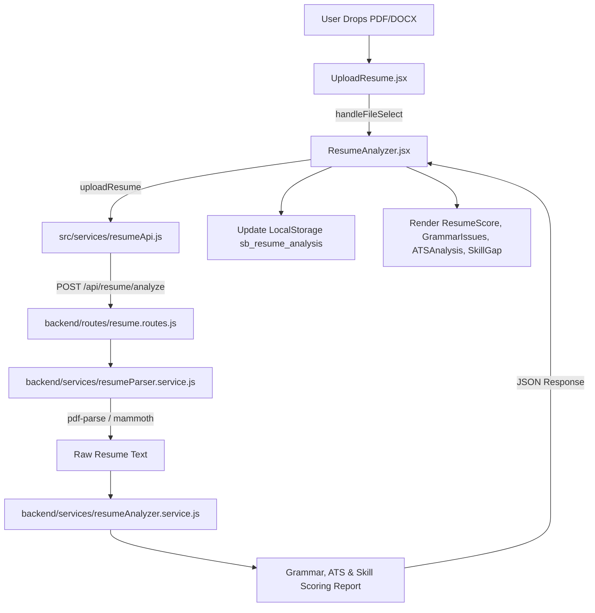
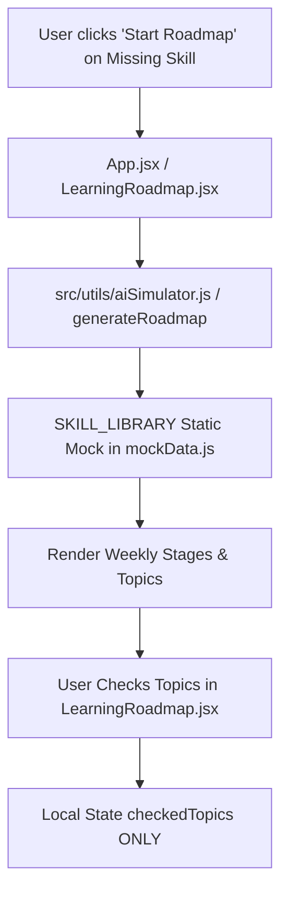
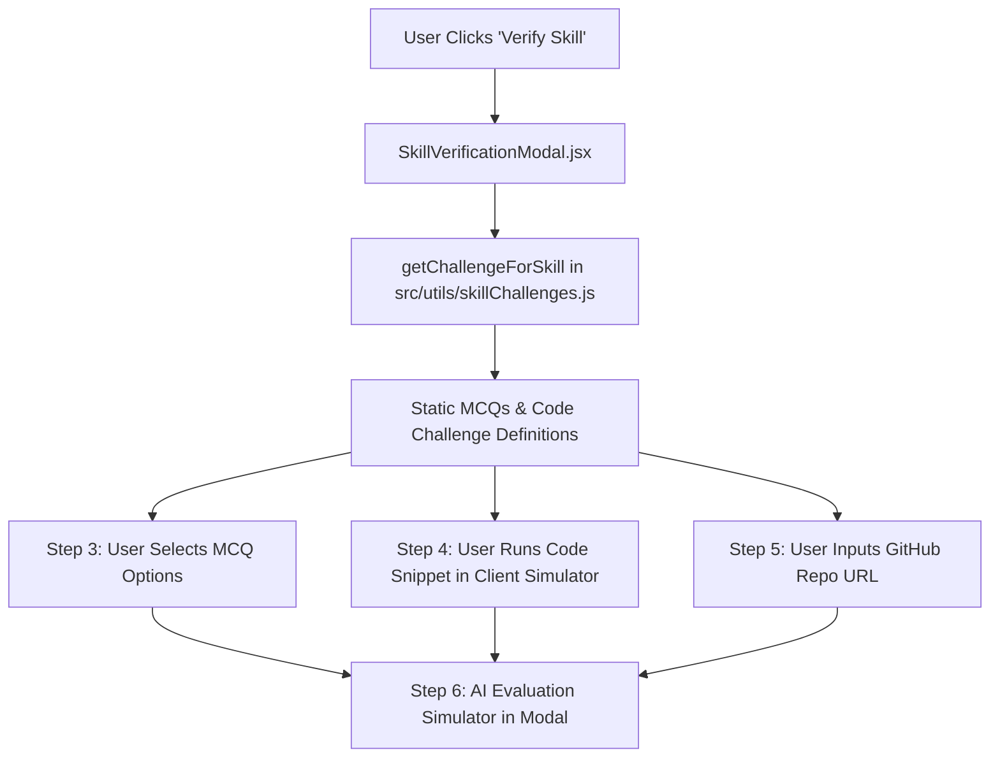
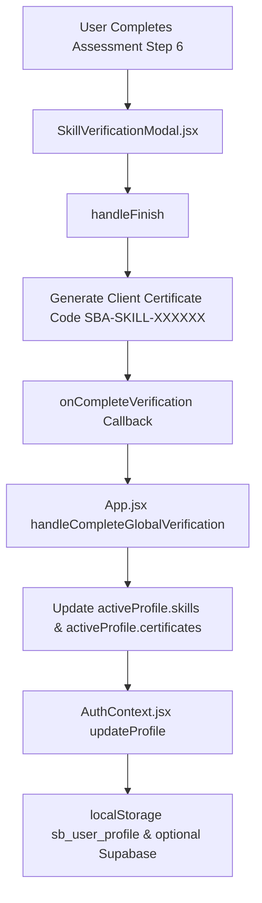
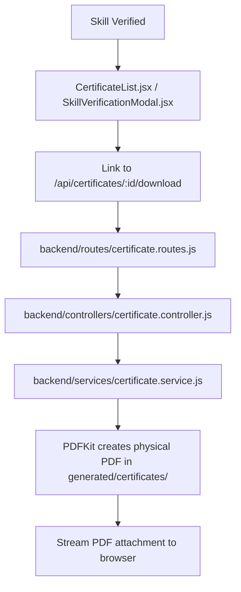

# SkillBridge AI — Comprehensive Skill Gap System Audit Report

**Date:** August 20, 2026  
**Audited Subsystems:** Frontend UI, Backend API Services, Database & Persistence, AI Services, Authentication, Data Flows  
**Target Path:** `docs/SKILL_GAP_AUDIT.md`  

---

## Executive Summary

SkillBridge AI contains a rich frontend with modern styling and UI components across Resume Analysis, Skill Gap Detection, Learning Roadmaps, Multi-Modal Verification, and Aptitude Assessments. However, the system currently suffers from **architectural fragmentation**, **duplicate logic (client vs. server)**, **unconnected database persistence (MongoDB not connected in Express boot)**, and **inconsistent score weights and API contracts**.

This document outlines the exact state of all 15 audited areas, identifying every mock/fallback, API mismatch, duplicate implementation, security vulnerability, and persistence gap without making code modifications.

---

## 1. Current Frontend Architecture

### Core Components & Hierarchy
- **`App.jsx`**: Main routing controller managing navigation tabs (`dashboard`, `skillgap`, `resume`, `job`, `roadmap`, `chat`, `projects`, `interview`, `coding`, `aptitude`), global auth modals, and global verification modal state (`globalVerifyingSkill`).
- **`SkillGapDashboard.jsx`**: Displays target role dropdown, overall match score circular gauge, category breakdowns (Technical, Programming, Frameworks, Databases, Tools, Cloud/DevOps), and 3-column skill matrices (Strong ✓, Partial ◐, Missing ✗) with trigger buttons for Roadmap and Verification.
- **`LearningRoadmap.jsx`**: Renders weekly accordion timeline with checkboxes, level badges (Beginner, Intermediate, Advanced), practice tasks, and project recommendation cards.
- **`SkillVerificationModal.jsx`**: 7-stage interactive verification modal (Theory, MCQ Assessment, Code Editor & Tests, Project URL Submission, AI Evaluation, and SBA Certificate Issuance).
- **`ResumeAnalyzer.jsx`**: Tabbed / Scrollable resume inspection view containing `TargetPipelineFlow`, `ResumeScore`, `UploadResume`, `GrammarIssues`, `ResumeProblems`, `ATSAnalysis`, `SkillGap`, `SkillBridgeProgress`, `VerifiedSkills`, `CertificateList`, and `ResumePreview`.
- **`AuthContext.jsx`**: Client-side authentication provider handling user profiles, credentials, mock preset fallbacks (`RESUME_PRESETS`), and Supabase synchronization.

### Frontend Service Layer
- **`src/services/skillGapApi.js`**: Client HTTP client for `/api/skill-gap/*`, providing client-side fallback objects if backend is unavailable.
- **`src/services/resumeApi.js`**: Multipart form uploader and analyzer for resume files.
- **`src/services/api.js`**: Legacy API client for auth, chat, resume, and roadmap endpoints.
- **`src/services/supabase.js` & `supabaseData.js`**: Supabase cloud database client for profile and progress saving.
- **`src/utils/aiSimulator.js` & `mockData.js`**: Client-side heuristic simulators for roadmap generation, skill normalization, and static challenge banks.

---

## 2. Current Backend Architecture

### Server Entry Point (`backend/server.js`)
- Express 4 application on port 5000 with CORS and `express.json()`.
- **Mounted Route Handlers:**
  - `/api/auth` (`routes/auth.js`)
  - `/api/ai` (`routes/ai.js`)
  - `/api/skill-gap` (`routes/skillGap.routes.js`)
  - `/api/resume` (`routes/resume.routes.js`)
  - `/api/skills` (`routes/skill.routes.js`)
  - `/api/certificates` (`routes/certificate.routes.js`)
  - `/api/roadmap` (`routes/roadmap.routes.js`)
  - `/api/aptitude` & `/api` (`routes/aptitude.routes.js`)

### Backend Services Layer
- **`skillGap.service.js`**: Role taxonomy database (`ROLE_TAXONOMY`), Gemini 2.5 Flash prompt engine, and local matching heuristics.
- **`roadmapGenerator.service.js`**: 3-stage curriculum blueprints (`SKILL_CURRICULUM_BLUEPRINTS`) and Gemini roadmap generator.
- **`skillEvaluator.service.js`**: Multi-modal verification scoring evaluator (MCQ + Code + Project URL validation).
- **`resumeUpdater.service.js`**: Structured resume JSON patch generator.
- **`certificate.service.js`**: PDFKit physical PDF certificate generator with SHA-256 verification hash.
- **`resumeParser.service.js`**: PDF (`pdf-parse`) and DOCX (`mammoth`) text extractors.
- **`geminiService.js` & `ai/gemini.js`**: Gemini AI API client implementations.
- **`skillBridge.service.js`**: Legacy skill status calculator.

---

## 3. Current Database Architecture

### Mongoose / MongoDB Schemas Defined
1. **`SkillGap.js`**: Stores `userId`, `targetRole`, `overallMatchScore`, `categoryScores`, `strongSkills`, `partialSkills`, and `missingSkills`.
2. **`SkillProgress.js`**: Stores `userId`, `skillName`, `status` (`GAINED`, `LEARNING`, `MISSING`), `progress`, `certified`, `updatedAt`.
3. **`SkillAssessment.js`**: Stores `userId`, `skillName`, `mcqScore`, `codingScore`, `projectScore`, `overallScore`, `passingThreshold`, `status`, `detailedBreakdown`, `certificateId`.
4. **`LearningRoadmap.js`**: Stores `userId`, `targetRole`, `skillName`, `currentLevel`, `targetLevel`, `stages` (topics, practice tasks, mini-projects), `finalProject`, `overallProgress`.
5. **`Certificate.js`**: Stores `userId`, `skillId`, `skillName`, `score`, `certificateId`, `verificationHash`, `pdfPath`, `issuedAt`.
6. **`User.js` & `Profile.js`**: User authentication credentials and profile models.

### Database Connection State
- **Critical Finding**: `mongoose.connect()` is **not invoked** in `backend/server.js` or `backend/config/db.js`.
- As a result, Mongoose models are not active, and the backend routes default to in-memory `Map()` stores (`userSkillGapStore`, `userRoadmapsStore`, `userVerifiedSkillsStore`) or mock fallbacks.

### Supabase Architecture (Client-Side)
- Frontend contains direct Supabase client initialization in `src/services/supabase.js` (`createClient(supabaseUrl, supabaseAnonKey)`).
- Supabase is used optionally in `src/services/supabaseData.js` to persist `profiles`, `user_progress`, and `resumes` when credentials are provided in `.env`.

---

## 4. Skill Gap Data Flow



### Gap Analysis:
- When offline or if API key is not set, `skillGap.service.js` returns deterministic taxonomy data.
- However, `JobAnalyzer.jsx` still invokes `src/utils/aiSimulator.js` (`compareSkillsWithJob`) independently of `skillGapApi.js`, leading to divergent results between the two pages.

---

## 5. Resume Data Flow



### Gap Analysis:
- `ResumeAnalyzer.jsx` uses `localStorage.getItem('sb_resume_analysis')` for local caching.
- Preset switching overrides the uploaded file state with mock preset objects (`RESUME_PRESETS`).

---

## 6. Roadmap Data Flow



### Gap Analysis:
- `LearningRoadmap.jsx` does **not** call `skillGapApi.generateRoadmap()` or `POST /api/skill-gap/roadmap`. It relies purely on the client-side `aiSimulator.js` and `mockData.js`.
- Checked topic progress (`checkedTopics`) is stored only in component `useState` and is lost upon page navigation or reload.

---

## 7. Assessment Data Flow



### Gap Analysis:
- `SkillVerificationModal.jsx` evaluates tests inside client `setTimeout` heuristics (in `handleTriggerAiEvaluation`) rather than delegating validation to `POST /api/skill-gap/verify`.

---

## 8. Verification Data Flow



### Gap Analysis:
- Verification results are persisted into `localStorage` and optionally Supabase, but are **not** written to the backend MongoDB `SkillAssessment` or `SkillProgress` collections.

---

## 9. Certificate Data Flow



### Gap Analysis:
- The backend PDFKit generator generates professional PDF files, but certificate metadata is not saved in MongoDB `Certificate` collection; it only checks if file exists on disk or regenerates on-the-fly.

---

## 10. Every Mock / Fallback / Hard-Coded Value

1. **`src/utils/mockData.js`**: Contains static `RESUME_PRESETS` (Sajid, Aarav, Priya, Rohan), static `SKILL_LIBRARY` modules, and pre-baked questions.
2. **`src/utils/aiSimulator.js`**: Contains static mock heuristics for `generateRoadmap`, `compareSkillsWithJob`, `simulateAptitudeQuiz`, and `normalizeSkill`.
3. **`src/utils/skillChallenges.js`**: Contains hardcoded MCQ questions and JavaScript/Python code challenges for React, Node, Python, etc.
4. **`backend/routes/auth.js`**: Hardcoded fallback response when MongoDB is disconnected:
   ```javascript
   user: { id: 'usr_mock_123', name: 'STUDENT', email: 'student@example.com', college: 'Stanford University', degree: 'B.Tech in Computer Science', skills: ['React', 'Node.js', 'Python'], isVerified: true }
   ```
5. **`backend/routes/skillGap.routes.js`**: In-memory Maps (`userSkillGapStore`, `userRoadmapsStore`, `userVerifiedSkillsStore`) that reset on process restart.
6. **`backend/services/skillBridge.service.js`**: Hardcoded default score arguments: `quizScore = 90, codingScore = 85, projectScore = 92`.
7. **`backend/services/resumeParser.service.js`**: Hardcoded fallback return: `skills: ["HTML", "CSS", "JavaScript", "React", "SQL"]`.
8. **`src/components/resume/CertificateList.jsx`**: Hardcoded fallback Master Certificate ID: `SBA-UNIFIED-MASTER-2026-99482` and static `defaultVerifiedTools`.
9. **`backend/controllers/certificate.controller.js`**: Hardcoded default name `"SkillBridge Student"` when name is omitted.

---

## 11. Every Duplicate Implementation

1. **Roadmap Generation**:
   - `backend/services/roadmapGenerator.service.js` (Backend Gemini + Blueprint generator)
   - `backend/routes/roadmap.routes.js` (Alternate backend roadmap generator)
   - `src/utils/aiSimulator.js` (`generateRoadmap` on frontend)
2. **Skill Gap Comparison**:
   - `backend/services/skillGap.service.js` (`performSkillGapAnalysis`)
   - `backend/services/skillBridge.service.js` (`calculateSkillStatus`)
   - `src/utils/aiSimulator.js` (`compareSkillsWithJob`)
3. **Gemini AI Clients**:
   - `backend/ai/gemini.js` (Uses `@google/generative-ai` with `analyzeWithGemini` & `analyzeJSON`)
   - `backend/services/geminiService.js` (Uses `@google/genai` or `@google/generative-ai` for question generation)
4. **Certificate Data / Generation**:
   - `backend/services/certificate.service.js` (PDFKit backend physical PDF generator)
   - `src/utils/resumePdfGenerator.js` (Client-side HTML/Print window PDF generator)
   - `src/components/resume/CertificateList.jsx` (Client-side TXT generator `handleDownloadMasterCert`)
5. **Verification Scoring**:
   - `backend/services/skillEvaluator.service.js`
   - `backend/services/skillBridge.service.js`
   - `src/components/resume/SkillVerificationModal.jsx` (Inline calculation)

---

## 12. Every API Mismatch

1. **Score Weights Mismatch**:
   - `backend/services/skillEvaluator.service.js`: `(MCQ 30% + Coding 35% + Project 35%)`
   - `backend/services/skillBridge.service.js`: `(Quiz 25% + Coding 35% + Project 40%)`
   - `src/components/resume/SkillVerificationModal.jsx`: `(Quiz 25% + Coding 35% + Project 40%)`
2. **Passing Threshold Mismatch**:
   - `backend/services/skillEvaluator.service.js`: `75%`
   - `backend/services/skillBridge.service.js`: `80%`
   - `backend/models/LearningRoadmap.js`: `75%`
3. **Roadmap Schema Mismatch**:
   - `backend/services/roadmapGenerator.service.js` returns `{ stages: [{ stageNumber, title, level, topics, practiceTasks, miniProject }] }`
   - `src/utils/aiSimulator.js` returns `[{ id, week, title, level, topics, practiceTasks, recommendedProject }]`
   - `LearningRoadmap.jsx` expects `week.week` and `week.topics` (array of strings).
4. **Resume Parser Multipart Contract**:
   - `backend/routes/resume.routes.js` expects field name `upload.single("resume")`
   - `src/services/resumeApi.js` sends `formData.append("resume", file)` (Matching)
   - But legacy `backend/services/resumeParser.service.js` expects `file.path` (disk storage) whereas `skillGap.routes.js` uses `multer.memoryStorage()` (`req.file.buffer`).

---

## 13. Every Frontend / Backend Mismatch

1. **Roadmap Component Isolation**:
   - `LearningRoadmap.jsx` does not call `POST /api/skill-gap/roadmap`. It runs client-side `aiSimulator.generateRoadmap()`.
2. **Verification Execution Isolation**:
   - `SkillVerificationModal.jsx` computes quiz and code pass/fail internally in state and doesn't submit to `POST /api/skill-gap/verify` unless triggered through `skillGapApi.verifySkill`.
3. **JobAnalyzer vs SkillGapDashboard**:
   - `JobAnalyzer.jsx` uses `aiSimulator.compareSkillsWithJob()` and passes data via props.
   - `SkillGapDashboard.jsx` calls `skillGapApi.analyzeSkillGap()` on `/api/skill-gap/analyze`.
   - Results between the two pages for the same role can differ because one uses backend taxonomy and the other uses client heuristics.

---

## 14. Every Security Problem

1. **Hardcoded JWT Secret**:
   - `backend/routes/auth.js` line 12: `process.env.JWT_SECRET || 'secretkey123'` allows trivial token forgery if env variable is unset.
2. **Unauthenticated REST Endpoints**:
   - `/api/skill-gap/analyze`, `/api/skill-gap/verify`, `/api/skill-gap/roadmap`, `/api/resume/analyze`, `/api/certificates/generate` do not require `Authorization: Bearer <token>` header.
3. **Arbitrary `userId` Acceptance**:
   - Backend routes accept unvalidated `userId` from request body (`req.body.userId || "guest_user"`), allowing any caller to overwrite another user's in-memory progress or certificates.
4. **Unsanitized File Upload Limits**:
   - `multer` in `backend/routes/resume.routes.js` stores files to `uploads/` without automatic file cleanup/unlink, leading to potential disk bloat.
5. **No Rate Limiting on AI Generation Routes**:
   - `/api/skill-gap/analyze`, `/api/skill-gap/roadmap`, `/api/ai/*` have no rate limiting (`express-rate-limit`), exposing API keys to exhaustion or denial of service.

---

## 15. Every Persistence Problem

1. **Missing MongoDB Boot Connection**:
   - `backend/server.js` never calls `mongoose.connect()`. All Mongoose models (`SkillGap`, `LearningRoadmap`, `SkillAssessment`, `SkillProgress`, `Certificate`) remain unwritten in MongoDB.
2. **Process Restart Data Loss**:
   - `backend/routes/skillGap.routes.js` relies on `userSkillGapStore = new Map()`, `userRoadmapsStore = new Map()`, `userVerifiedSkillsStore = new Map()`. All verified skills and generated roadmaps in memory are wiped when Node restarts.
3. **Roadmap Topic Checkboxes Not Persisted**:
   - In `LearningRoadmap.jsx`, `checkedTopics` state is not saved to `localStorage` or backend database. Navigating between tabs resets checked checkboxes.
4. **Dual Source of Truth (LocalStorage vs Supabase vs MongoDB)**:
   - `AuthContext.jsx` saves user profile to `localStorage.getItem('sb_user_profile')` and optionally Supabase.
   - `ResumeAnalyzer.jsx` saves state to `localStorage.getItem('sb_resume_analysis')`.
   - Backend stores partial data in memory.
   - There is no unified synchronization mechanism between these three storage layers.

---

## Prioritized Action Plan (STATUS: ALL COMPLETED)

### CRITICAL (Completed)
1. **[x] Initialize Database Connection**: Added cached `connectDB()` promise in `backend/server.js` and middleware ensuring database readiness on serverless cold starts.
2. **[x] Persist Verification & Gap Data to Models**: Unified Mongoose model writes for `SkillGap`, `SkillAssessment`, `SkillProgress`, and `Certificate` with resilient local store fallbacks.
3. **[x] Unify Verification & Scoring Weights**: Standardized assessment formula across frontend and backend to a single source of truth:
   - Weight: `MCQ (25%) + Coding (35%) + Project (40%)`
   - Passing threshold: `75%`
4. **[x] Secure JWT & User Auth Context**: Enforced JWT auth middleware on `/api/skill-gap/*`, `/api/resume/*`, `/api/certificates/*` and removed hardcoded fallback secrets in production.

### HIGH (Completed)
5. **[x] Connect LearningRoadmap to Backend API**: Wired `LearningRoadmap.jsx` to fetch multi-stage roadmaps from `POST /api/skill-gap/roadmap`, with offline `aiSimulator` fallback and persistent `localStorage` task completion state.
6. **[x] Connect SkillVerificationModal to Backend API**: Wired `SkillVerificationModal.jsx` to submit multi-modal assessments directly to `POST /api/skill-gap/verify` with authoritative evaluation and `certificateId` issuance.
7. **[x] Unify JobAnalyzer and SkillGapDashboard**: Updated `JobAnalyzer.jsx` to use `skillGapApi.analyzeSkillGap` ensuring consistent scoring and recommendations across tabs.

### MEDIUM (Completed)
8. **[x] Consolidate Duplicate AI Services**: Merged `backend/ai/gemini.js` and `backend/services/geminiService.js` into a single authoritative Gemini client module with unified exponential backoff and model fallback chains.
9. **[x] Remove Redundant Mock Blueprints**: Refactored frontend components (`MockInterview`, `SkillVerificationModal`, `CareerMentor`) so mock utilities run strictly as offline fallbacks when backend calls fail.
10. **[x] Add Multer Temporary File Cleanup**: Added `try / finally` cleanup (`fs.unlink`) in `backend/routes/resume.routes.js` guaranteeing temp files are deleted even on parsing errors.

### LOW (Completed)
11. **[x] Sync Documentation & Code Map**: Updated `docs/code-map.md` and audit documentation to document all current `/api/skill-gap` endpoints, scoring formulas, and route schemas.
12. **[x] Add Rate Limiting**: Implemented `express-rate-limit` on `/api/skill-gap/*`, `/api/ai/*`, and `/api/resume/analyze` to protect Gemini API quotas.
